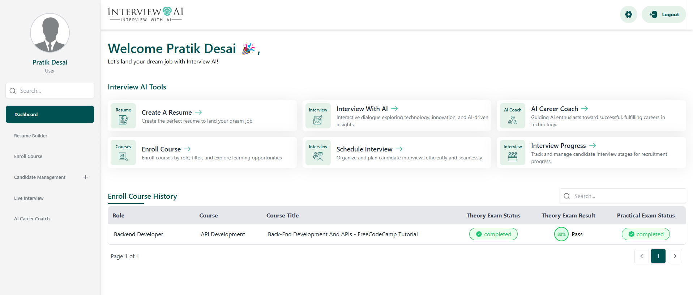

# Interview AI

Interview AI is a comprehensive platform designed to streamline recruitment processes, enhance user career development, and provide AI-powered mock interviews and career coaching. The platform offers distinct roles and tailored features for Admins, Users, and Recruiters witch is available on https://interview-ai-frontend-0ogz.onrender.com/

.

## Roles and Features

### 1. **Auth Features**
- **Login**: Secure authentication for all users.
- **Registration**: Easy onboarding for new users.
- **Forget Password**: Password recovery functionality.

### 2. **Admin Features**
- **Add Role**: Define and manage roles for platform users.
- **Add Course**: Create and update courses for users.
- **Add Skills**: Populate a skill database for user profiles and courses.
- **Add Exam**: Organize both theory and practical exams for courses.
- **Add Recruiter**: Manage and onboard recruiters.

### 3. **User Features**
- **Resume Builder**: Create professional resumes directly on the platform.
- **Enroll Course**: Access courses and take exams (Theory and Practical).
- **Schedule Interview**: Book interview slots seamlessly.
- **Mock Interview with AI**: Practice interviews with AI-driven feedback.
- **AI Career Coach**: Personalized career guidance powered by AI.

### 4. **Recruiter Features**
- **Interview Review**: Assess user interviews and provide feedback.
- **Conduct Interviews**: Host live interviews using Google Meet.


## Tech Stack
- **Frontend**: React
- **Compiler**: Vite
- **Style**: Tailwind CSS
- **API Call**: axios
- **Hosting**: Render and Vercel
- **Other**: Datepicker, react-paginate, swiper, etc...


## Project Structure
```
├── src
│   ├── auth             # auth component like login, registration
│   ├── components       # Reusable components
│   ├── pages            # Application pages
│   ├── services         # API calls and utilities
│   ├── utils            # Helper functions
├── public               # Public assets
├── .env                 # Environment variables
├── package.json         # Dependencies and scripts
```

## 🚀 Installation
- Clone the Repository
```
git clone https://github.com/swiftrut/Interview_AI-frontend.git
```
- Install dependencies
```
npm install
```
- Run the development server
```
npm run dev
```
- Build for production
```
npm run build
```